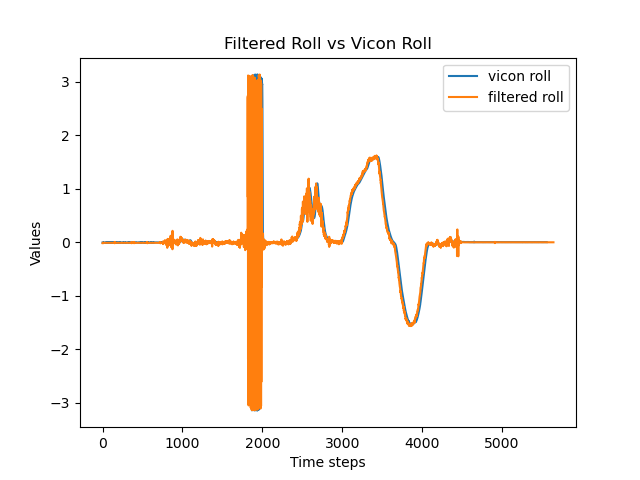
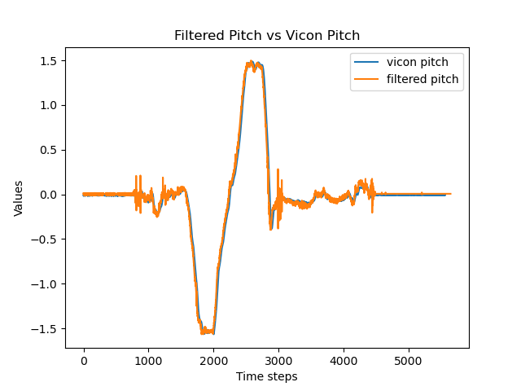
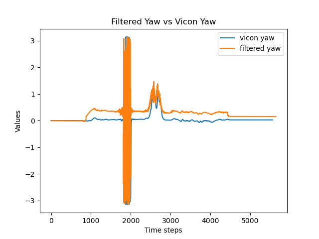
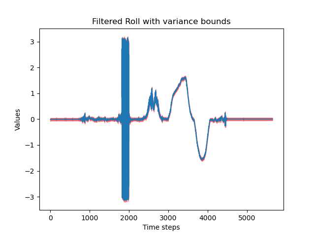
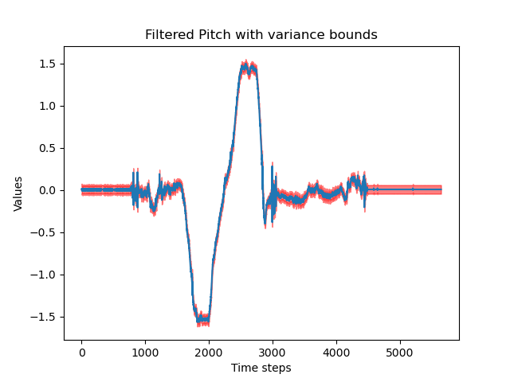
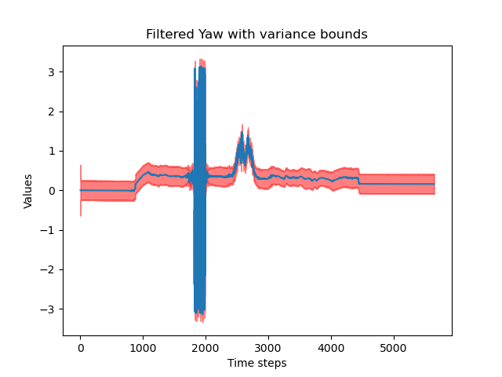

# Orientation tracking of a Quadrotor using an Unscented Kalman Filter

This project was part of the course ESE650: Learning in Robotics at UPenn. This project involves implementing Quaternion-based orientation tracking using an Unscented Kalman filter. The algorithm was adopted from the paper : [Unscented-Kalman filter](https://ieeexplore.ieee.org/document/1257247). Quaternion representation of the orientation is much more efficient in terms of computation. The non-linear relationship between the estimated orientation and the measurements prevents the usage of the classical Kalman filter. This is where the Unscented Kalman filter comes into effect, allowing nonlinear process and measurement models, and is more accurate than Extended Kalman Filters.

# Results

The algorithm is tested with Vicon data.

  

  

  

  

  

  

